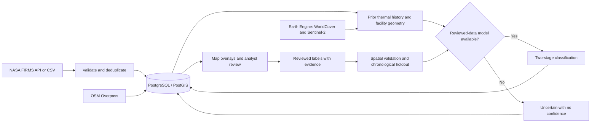

# AgniNetra architecture

SIH26162 prototype: a React/MapLibre client, FastAPI backend, PostgreSQL/PostGIS datastore, contextual enrichment services and a two-stage supervised classifier.

The frontend also supports a clearly dated NASA/OSM snapshot without the database. Snapshot points are unclassified and cannot save operational actions.

The database includes detections, facilities, feature records, predictions, review feedback, alerts, users, model versions, ingestion logs, audit logs, monitoring zones and a land-cover table. WorldCover sampling currently attaches context to feature records; there is no implemented country-wide land-cover polygon import. Spatial columns use EPSG:4326. Inference decodes WKB/WKT, computes distances in km and tests available footprints for actual containment.

The model interface defines 37 fields in `ml/config.py`; some remain unavailable until their data or analysis is implemented. Real-time feature extraction uses prior detections only and pre-event imagery. The runtime refuses unverified/synthetic artifacts and never trains a replacement automatically. See [model_card.md](model_card.md) for training and evaluation limitations.

The in-process SSE service publishes named invalidations after database commits, including calls from synchronous worker threads. Clients refetch current database state; the stream is not a persistent audit log. Deploy one worker until a shared broker and scheduler coordination are implemented.

Authentication components exist but are not applied to all application endpoints. Migrations have been rendered as SQL locally; live PostGIS, authenticated Earth Engine and deployment validation remain outstanding. See [deployment_guide.md](deployment_guide.md).
